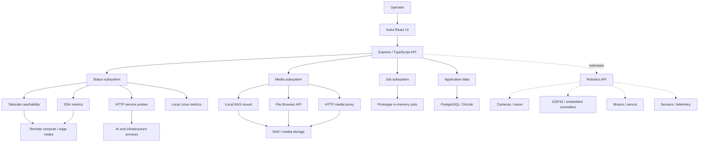

# Astra UI Architecture

This document describes Astra UI as a systems-integration project rather than only a frontend application.

## Design objective

Astra provides one operator interface for a mixed environment containing local AI services, Linux hosts, GPU workstations, storage, and edge/robotic devices. The frontend is intentionally separated from infrastructure-specific logic so new hosts and devices can be integrated through backend services without redesigning the UI.

## System view



## Frontend

The client is a React 18 / TypeScript single-page application. It uses shared API contracts and dedicated hooks so views are not tightly coupled to backend implementation details.

Primary UI surfaces:

- **Chat** — console and structured response cards
- **Media** — browsing, filtering and playback
- **Jobs** — workload creation and status views
- **Nodes** — infrastructure health and metrics
- **Settings** — operator configuration

Important frontend characteristics:

- TanStack React Query for server-state access
- shared TypeScript/Zod contracts
- modular page and component structure
- responsive Tailwind-based UI
- frontend/backend separation through REST endpoints

## Status and diagnostics subsystem

The backend performs real infrastructure checks rather than only displaying seeded status values.

### Reachability

Remote hosts can be checked with Tailscale. A failed network probe is surfaced separately from application/service failures so an operator can distinguish host-level reachability from degraded services.

### Remote metrics

When a remote node is reachable, Astra can collect Linux metrics over SSH, including:

- CPU utilization
- memory utilization
- root filesystem usage
- running Docker container count

SSH failures are handled as unavailable metrics rather than crashing the status request.

### Local metrics

The Astra host can report equivalent CPU, memory, disk and Docker information using local Linux commands.

### Service checks

HTTP probes test configured services independently of host reachability. This allows a machine to remain online while a specific application is reported as unhealthy.

## Hermes media subsystem

The media layer supports more than one access strategy so the UI does not depend on a single storage protocol.

### Local mount

When a NAS share is mounted locally, the backend can enumerate files directly and stream content from the filesystem.

### File Browser API

When configured, Astra can authenticate to a File Browser-compatible service and normalize returned media entries for the frontend.

### HTTP fallback

Directory/HTTP access can be used as another integration path where appropriate.

### Media proxy

The backend supports byte-range requests, enabling efficient seeking and playback of large video files without loading an entire file into memory.

## Jobs

The current jobs subsystem is intentionally a prototype. Jobs are suitable for exercising the UI and API model, but the present implementation is not represented as a production distributed scheduler.

A production evolution could dispatch work to:

- GPU inference nodes
- image/video generation services
- computer-vision pipelines
- automation workers
- robotics/edge devices

## Data model

PostgreSQL and Drizzle provide the persistent application data layer and shared schemas provide typed validation between backend and frontend code.

The architecture keeps infrastructure monitoring separate from persistent application state. This allows live system checks to continue evolving independently from the database-backed features.

## Robotics extension model

Astra is designed so physical devices can be treated as another class of networked node.

A robotics integration can expose endpoints for:

```text
/api/robot/status
/api/robot/motors
/api/robot/servos
/api/robot/sensors
/api/robot/cameras
/api/robot/power
```

A robot or edge device could then report:

- battery voltage/current
- motor-controller state
- CPU temperature
- network latency
- camera availability
- sensor health
- fault codes
- active task

Control requests could be separated from monitoring requests, allowing permissions, logging and safety interlocks to be added later.

## Engineering principles

### Separate connectivity from service health

A reachable machine is not necessarily a healthy service. Astra treats these as different failure domains.

### Prefer real diagnostics

Where practical, the backend queries actual hosts, services and storage rather than inventing status data.

### Fail gracefully

Unreachable hosts, missing metrics and storage errors should degrade individual cards/endpoints instead of taking down the dashboard.

### Keep infrastructure replaceable

The frontend consumes normalized APIs instead of embedding NAS, SSH or Tailscale logic in UI components.

### Document prototype boundaries

Development scaffolding is explicitly identified as prototype behavior so the repository does not imply capabilities that are not yet implemented.
